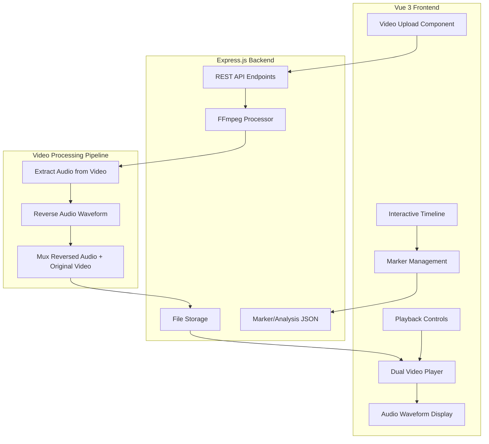

# Double Think: Video-Based Reverse Speech Analysis

## Overview

Transform the current audio-only Double Think application into a **video-first reverse speech analysis platform**. Users will upload video files (MP4/WebM), the system will extract and reverse the audio, then provide side-by-side playback of the original and remixed videos for analysis.

---

## Architecture Diagram



---

## Backend Implementation Plan

### 1. Video Processing Endpoint

**New Endpoint:** `POST /api/process-video`

**Processing Pipeline:**
1. Accept video file upload via multer
2. Extract audio: `ffmpeg -i input.mp4 -vn -acodec pcm_s16le audio.wav`
3. Reverse audio using fluent-ffmpeg areverse filter
4. Mux back: `ffmpeg -i input.mp4 -i reversed_audio.wav -c:v copy -c:a aac -map 0:v:0 -map 1:a:0 output.mp4`
5. Store both original and processed videos
6. Return URLs for both videos and analysis metadata

**File Structure:**
```
outputs/
├── videos/
│   ├── original_<timestamp>.mp4
│   └── reversed_<timestamp>.mp4
├── audio/
│   ├── extracted_<timestamp>.wav
│   └── reversed_<timestamp>.wav
└── analysis/
    └── video_analysis_<timestamp>.json
```

### 2. Marker Management Endpoints

- `POST /api/markers` - Save a timeline marker
- `GET /api/markers/:analysisId` - Get markers for a video
- `PUT /api/markers/:markerId` - Update marker annotation
- `DELETE /api/markers/:markerId` - Delete a marker

**Marker Schema:**
```json
{
  "id": "marker_123",
  "analysisId": "video_1234567890",
  "timestamp": 45.5,
  "label": "Interesting reversal",
  "color": "#ff6384",
  "createdAt": "2024-01-01T00:00:00Z"
}
```

### 3. Video Snippet Extraction Endpoint

**New Endpoint:** `POST /api/extract-video-snippet`

Extract a segment of reversed audio from the video for saving and annotation.

**Request:**
```json
{
  "analysisId": "video_1234567890",
  "start": 45.5,
  "end": 48.2,
  "playbackSpeed": 0.75,
  "annotation": "Clear reversed phrase here"
}
```

**Response:**
```json
{
  "id": "snippet_123",
  "file": "snippet_1234567890.wav",
  "url": "/outputs/snippets/snippet_1234567890.wav",
  "forwardFile": "forward_snippet_1234567890.wav",
  "forwardUrl": "/outputs/snippets/forward_snippet_1234567890.wav",
  "start": 45.5,
  "end": 48.2,
  "duration": 2.7,
  "annotation": "Clear reversed phrase here",
  "playbackSpeed": 0.75// Original snippet speed for reference
}
```

**Server Processing:**
1. Use FFmpeg to extract audio segment from reversed audio file
2. Also extract forward audio segment from original for comparison
3. Save both snippets to `outputs/snippets/`
4. Add to analysis JSON for persistence

### 4. Video Browser Endpoint

- `GET /api/videos` - List all processed videos with metadata
- `DELETE /api/videos/:id` - Delete video and associated files

---

## Frontend Implementation Plan

### 1. New Component: VideoAnalyzer.vue

**Layout:**
```
┌─────────────────────────────────────────────────────────────────┐
│  Video Upload / Select Existing                                   │
├─────────────────────────────────────────────────────────────────┤
│  ┌───────────────────────┐    ┌───────────────────────────────┐  │
│  │   Original Video      │    │   Reversed Audio Video        │  │
│  │   [►/❚❚] 0:45/3:20    │    │   [►/❚❚] 0:45/3:20            │  │
│  └───────────────────────┘    └───────────────────────────────┘  │
├─────────────────────────────────────────────────────────────────┤
│  [◄◄] [►/❚❚] [►►]  Speed: [0.25x ▼]  Volume: [━━━━○━━━]          │
├─────────────────────────────────────────────────────────────────┤
│  Timeline with Waveform (drag to select region):                 │
│  ├──[███████]──●────────────●──────────────────────────────────┤ │
│  (Selected region shown, markers as clickable dots)              │
├─────────────────────────────────────────────────────────────────┤
│  [Play Selected] [Save Snippet] [Clear Selection] [Loop: Off]   │
├─────────────────────────────────────────────────────────────────┤
│  Marker List:                                                    │
│  • 0:45 - Interesting phrase here [Edit] [Delete]                │
│  • 1:23 - Another spot [Edit] [Delete]                           │
│  [+ Add Marker at Current Position]                              │
├─────────────────────────────────────────────────────────────────┤
│  Saved Snippets:                                                 │
│  ┌─────────────────────────────────────────────────────────────┐ │
│  │ Snippet 1 (0:45-0:48, 0.75x)                                 │ │
│  │ [Reversed ▶] [Forward ▶] Annotation: Clear message          │ │
│  │ [Download Reversed] [Download Forward] [Delete]              │ │
│  └─────────────────────────────────────────────────────────────┘ │
└─────────────────────────────────────────────────────────────────┘
```

**Features:**
- Dual synchronized video players (original left, reversed-audio right)
- Shared timeline control - scrubbing affects both videos
- Playback speed: 0.25x, 0.5x, 0.75x, 1x, 1.5x, 2x
- Loop selected segment functionality
- Volume boost slider (up to 200%)
- Click-to-mark current timestamp

### 2. Timeline with Waveform

Use WaveSurfer.js to display the reversed audio waveform below the videos:
- Visual representation helps identify potential phonetic patterns
- Click on waveform to seek both videos
- Region selection for loop playback
- Markers displayed as visual pins on the timeline

### 3. Playback Controls

**Speed Control:**
- Dropdown: 0.25x, 0.5x, 0.75x, 1x, 1.5x, 2x
- Apply to both video elements simultaneously

**Loop Functionality:**
- Set loop start/end via waveform region selection
- Toggle loop on/off
- Visual indication of looped segment

**Volume Boost:**
- Slider from 0% to 200%
- Uses Web Audio API GainNode for amplification beyond 100%

### 4. Updated Navigation

Modify [`src/main.js`](src/main.js:14) routes:
```javascript
const routes = [
  { path: '/', redirect: '/video' },
  { path: '/video', component: VideoAnalyzer },      // NEW - Primary
  { path: '/file', component: AudioAnalyzer },       // Keep for audio-only
  { path: '/realtime', component: RealTimeAnalyzer },
  { path: '/videos', component: VideoBrowser },      // NEW - Browse processed
  { path: '/snippets', component: SnippetLibrary },
  { path: '/outputs', component: OutputBrowser },
];
```

---

## Technical Implementation Details

### FFmpeg Commands

**Extract Audio:**
```bash
ffmpeg -i input.mp4 -vn -acodec pcm_s16le -ar 44100 -ac 1 audio.wav
```

**Reverse Audio:**
```bash
ffmpeg -i audio.wav -af areverse reversed_audio.wav
```

**Mux Reversed Audio with Original Video:**
```bash
ffmpeg -i input.mp4 -i reversed_audio.wav -c:v copy -c:a aac -map 0:v:0 -map 1:a:0 -shortest output.mp4
```

### Video Player Synchronization

```javascript
// Sync both players to same timestamp
const syncVideos = (masterVideo, slaveVideo) => {
  masterVideo.addEventListener('seeked', () => {
    slaveVideo.currentTime = masterVideo.currentTime;
  });
  masterVideo.addEventListener('play', () => slaveVideo.play());
  masterVideo.addEventListener('pause', () => slaveVideo.pause());
  masterVideo.addEventListener('ratechange', () => {
    slaveVideo.playbackRate = masterVideo.playbackRate;
  });
};
```

### Volume Boost Implementation

```javascript
// Web Audio API for volume beyond 100%
const audioContext = new AudioContext();
const source = audioContext.createMediaElementSource(videoElement);
const gainNode = audioContext.createGain();
gainNode.gain.value = 2.0; // 200% volume
source.connect(gainNode);
gainNode.connect(audioContext.destination);
```

---

## File Changes Summary

### New Files to Create
1. `src/components/VideoAnalyzer.vue` - Main video analysis component
2. `src/components/VideoBrowser.vue` - Browse processed videos
3. `src/composables/useVideoSync.js` - Video synchronization logic
4. `src/composables/useMarkers.js` - Marker management
5. `src/composables/useVolumeBoost.js` - Web Audio volume control

### Files to Modify
1. `src/main.js` - Update routes
2. `src/App.vue` - Update navigation tabs
3. `server/index.js` - Add video processing endpoints
4. `package.json` - No new dependencies needed (existing fluent-ffmpeg works)

---

## Dependencies

**Already Available:**
- `fluent-ffmpeg` - Video/audio processing
- `ffmpeg-static` - FFmpeg binary
- `wavesurfer.js` - Waveform visualization
- `multer` - File uploads
- `express` - Server

**Optional Additions:**
- `video.js` - Enhanced video player (can use native HTML5 video instead)

---

## Implementation Order

1. Backend video processing pipeline
2. Video upload and processing API endpoint
3. VideoAnalyzer.vue with dual player layout
4. Video synchronization and playback controls
5. Waveform timeline integration
6. Marker system (save/edit/delete)
7. VideoBrowser component
8. Route updates and navigation
9. Testing and refinement
